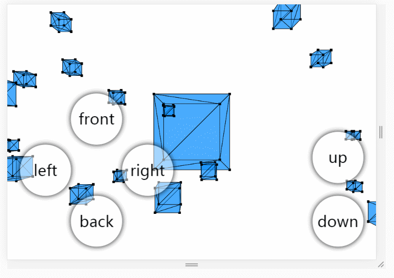

# Canvas3D

一款运行在HTML5上的单文件极简3D引擎，用来验证3D图形学上的理论。

# 概况

这是一个用于实验目的的3D引擎，是我为了好玩和挑战编程技巧所写的。源代码710行，去除注释后约570行，全部都写在单个HTML文件里。这个引擎实现了一个基于HTML5的跨平台3D坐标运算引擎，能够实现一个简单地3D流水线，进行模型坐标->世界坐标->相机坐标->透视坐标的变换。引擎通过三角函数和矩阵来进行顶点坐标的旋转和投影，最终显示到了屏幕上。这个引擎能够支持一个完整的欧拉相机，进行旋转和平移。

# 操作方式

PC端：WASD控制前后左右，IJKL控制相机转动，ZX控制上升下降，NM控制Z轴旋转

移动端：左下角按钮控制前后左右，滑动控制相机转动，右下角按钮控制上升下降

# 关于开源协议

仓库中Canvas3D引擎本身(canvas.html)，以及通过该程序衍生得产品，如Demo视频，均属于开源软件，遵守GNU通用公共许可证，即GNU GPL。

GNU GPL协议授予程序接受人以下权利，或称“自由”：

- 以任何目的运行此程序的自由；

- 再发行复制件的自由；

- 改进此程序，并公开发布改进的自由。

GNU GPL不会授予许可证接受人无限的权利。再发行权的授予需要许可证接受人开放软件的源代码，及所有修改。且复制件、修改版本，都必须以GPL为许可证，这是为了确保任何使用者不会独自占有开源软件。使用、复制或更改Canvas3D的程序接受人视为同意GNU GPL协议，必须再次开源其更改后的派生物（如源代码等），否则将追究法律责任。

关于协议版本，Canvas3D使用GPL v2协议。

关于GPL v2协议，上述说明仅做参考，具体细节请以LICENSE为准，SugarOS原作者Jackie Lin(用户名lyj00912，<https://github.com/lyj00912> )保留一切解释权。